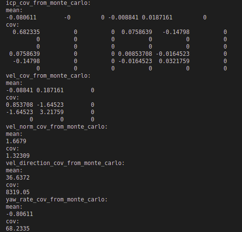
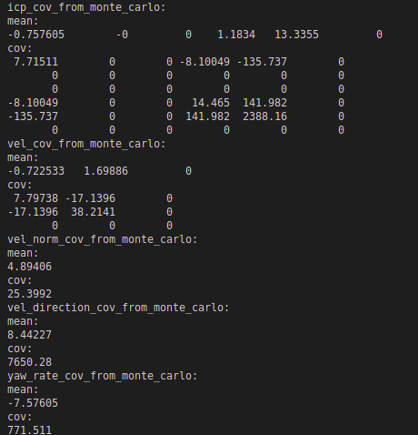
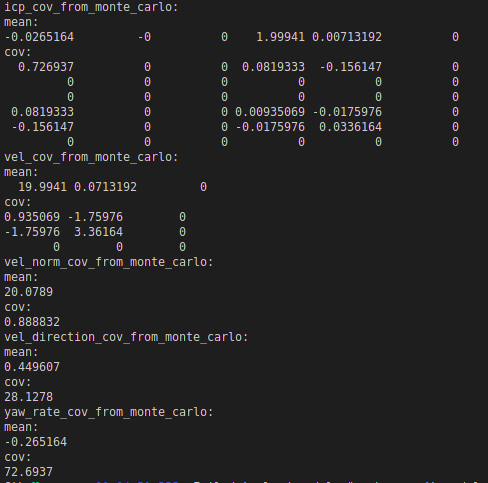
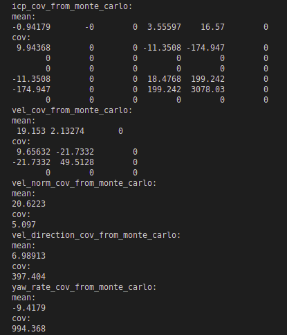
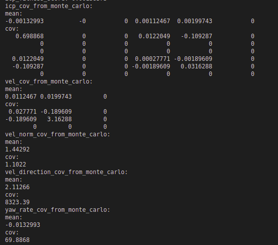
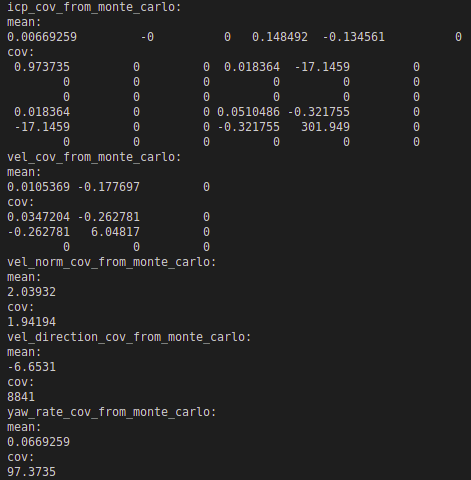
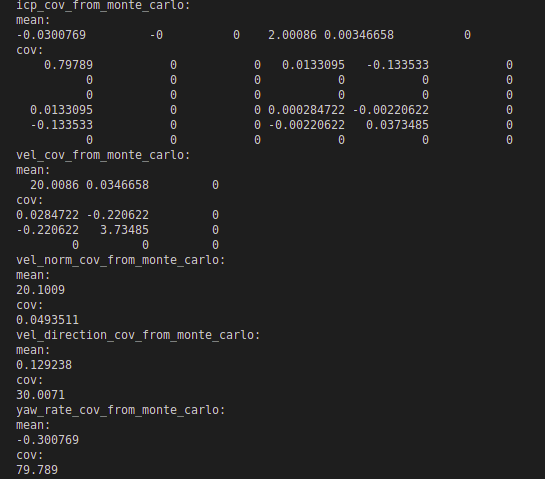
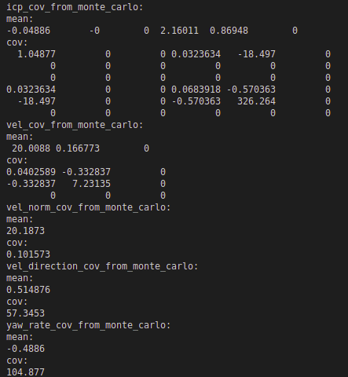

# icp_covariance

## 代码架构
* app: 主程序
* 数据生成(DataGenerator): 单例
* 可视化(Visualization): 单例
* PclAlignment: 单例
* IcpCovariance: 单例
* Config: 单例. 使用yaml-cpp，使用方法详见https://blog.csdn.net/briblue/article/details/89515470
* utils: 工具函数

## 实验结果
* 静止目标车锚点坐标(10, 5, 0)如图所示
* 
* 
* 运动目标车锚点坐标(10, 5, 0)如图所示 
* 
* 
* 静止目标车锚点坐标(10, 0.001, 0)如图所示 
* 
* 
* 运动目标车锚点坐标(10, 0.001, 0)如图所示 
* 
* 
### icp_cov受哪些因素影响
* target size越大，icp_cov越小
* angle resolution变大或者变小，icp_cov都有可能变大
* target在ego系下的距离: 物体较远时，点数较少，受初始位姿影响较大，为了防止发散，应该增加位姿正则或者correspondence正则(相邻两帧点云中相同激光头相同激光时序的点认为是correspondence)
* target在ego下的姿态(p+q -> I-shape/L-shape)
* 多线激光雷达vs单线激光雷达
* velodyne vs livox

## TODO
* icp仿真: icp_cov计算的绝对速度和绝对旋转角速度的精度评估＋如何识别退化情况(cov / fitness / ...)
  * 比较直接计算绝对速度 vs 先计算相对速度再推算绝对速度两种速度计算方案对于点云噪声的响应大小 (DONE，间接计算出的速度和位移都会比直接计算的要准确很多) 
  * 3d实验
  * hessian + cost function计算icp_cov
  * 分析影响icp_cov的因素
  * 为什么估计的速度会存在较大bias
  * 尝试不同icp方案
  * 手写icp(相邻两帧同一个laser在目标车上扫到的点云属于同一个平面，符合点到线的约束．但是，存在一个前提，自车和目标车不存在颠簸)
* 可视化(1d,2d,3d) ros visualization: rviz + PlotJuggler + Pangolin
* 视觉仿真
  * 使用相同的生成数据X_{t-1}, X_t，T_init生成图像数据，并进行of_cov的计算
* 视觉 + icp: 视觉提供高精度旋转,icp提供高精度位置  
* 工具链
  * 单次仿真实验结果保存:每一次的仿真结果都保存下来(原始数据，中间结果，计算结果，可视化图像)
  * 引入参数文件（每次加入参数需要改动的地方尽量少）
* 逻辑细节完善  
  * vel_est在pcl_alignment中计算, vel_gt在data_generator中计算 (DONE)
  * pcl_alignment的点云是ego系的 (DONE)
    * 如果是世界系，当ego position是几千公里时，会出现点云精度不够的问题
    * 如果是世界系，计算出的icp_transform进一步直接计算出的世界系的绝对速度对icp_transform的精度比较敏感.但是，如果是ego系，计算出的ego系速度对于icp_transform的精度就不会那么敏感．具体而言: ego_position为1000m, target_position_in_ego为10m，则通过世界系icp_transform计算出的绝对速度关于旋转误差的敏感程度是间接算出的绝对速度的敏感程度的100倍．
* 没有解释清楚的现象
  * 为什么速度估计的结果存在较大的bias
  * 为什么速度越大,bias和cov会越小    
  * 仿真实验并没有看到正前方性能明显退化的现象
